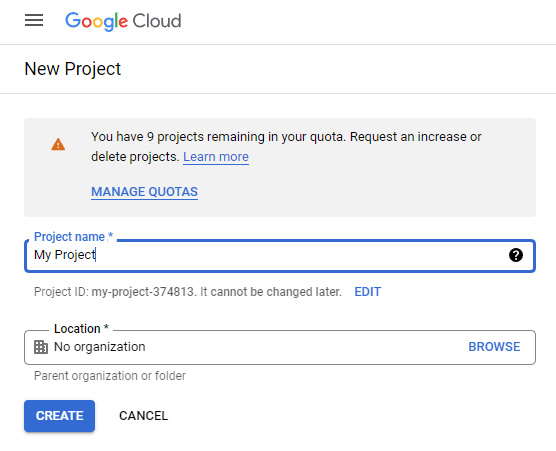
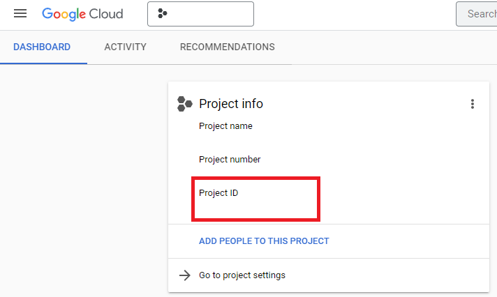
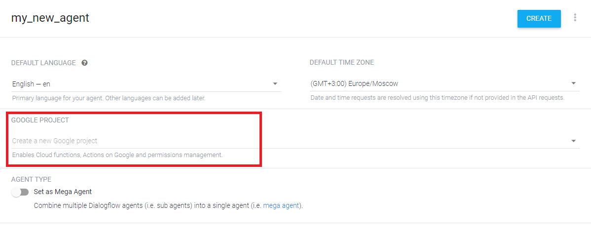
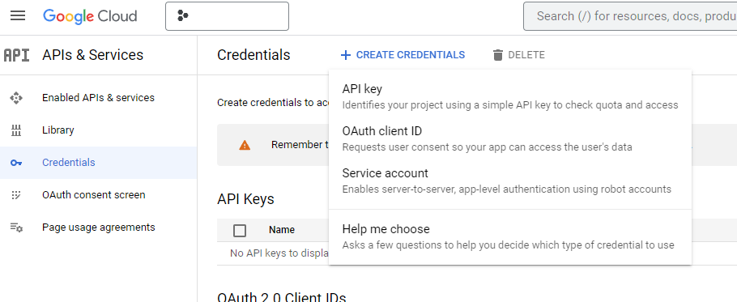
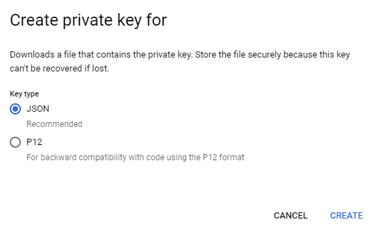
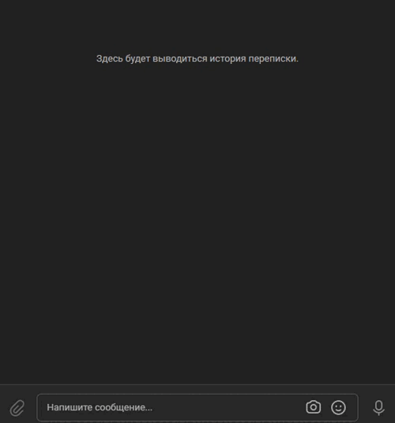

# Speech recognition

Bot for technical support of the company «Игра глаголов».

## How to install

- Сlone this repository:
```bash
git clone git@github.com:MaxHC-vlop/speech_recognition.git
```
- You must have python3.9 (or higher) installed.

- Create a virtual environment on directory project:
```bash
python3 -m venv env
 ```
- Start the virtual environment:
```bash
. env/bin/activate
```
- Then use pip to install dependencies:
```bash
pip install -r requirements.txt
```
### Create a Dialog Flow Project

- Create new project (help [here](https://cloud.google.com/dialogflow/es/docs/quick/setup)):



- Memorize the meaning `Project ID`:



- Create `New agent` (help [here](https://cloud.google.com/dialogflow/es/docs/quick/build-agent)). The `Project ID` must match the previously created project:



- Create a service account (help [here](https://cloud.google.com/docs/authentication/client-libraries)):



- Generate a json private key for the service account and save it in the project directory:



### Virtual environment

- Create a .env file in the project directory:
```bash
touch .env
```

- Create two bots with [BotFather](https://t.me/BotFather) and get their tokens:
  - ChatBot
  - LoggerBot

- Create api key for VK group(help [here](https://vk.com/@pinttiskad-kak-uznat-token-gruppy)).

- Fill in the `.env` file:
```env
TELEGRAM_BOT_TOKEN='telegram_bot_token'

LOGGER_BOT_TOKEN='your_bot_tokeb'

ADMIN_CHAT_ID='your_telegram_chat_id'

PROJECT_ID='your Project ID'

VK_BOT_TOKEN='vk_group_token'

GOOGLE_APPLICATION_CREDENTIALS='path/your/json/file'
```

## Telegram bot

- Run:
```bash
python telegram_bot.py
```

- You will see in the chat with the [bot](https://t.me/baladoshka_bot):


## Vk bot

- Run:
```bash
python vk_bot.py
```

- You will see in the chat with the [bot](https://vk.com/club21721363):



## Intents loader
Loads new phrases to communicate with the bot from your json file.

- Create a json file called `questions.json` then populate it:
```json
{
    // title
    "Устройство на работу": {
        // questions for learning
        "questions": [
            "Как устроиться к вам на работу?",
            "Как устроиться к вам?",
            "Как работать у вас?",
            "Хочу работать у вас",
            "Возможно-ли устроиться к вам?",
            "Можно-ли мне поработать у вас?",
            "Хочу работать редактором у вас"
        ],
        // response
        "answer": "Если вы хотите устроиться к нам, напишите на почту game-of-verbs@gmail.com мини-эссе о себе и прикрепите ваше портфолио."
    }
}
```

- Argument intents_loader.py:

  `-f --filepath` - if your file name is different, specify it (default `questions.json`)

- Example:
```bash
python intents_loader.py -f your_file.json
```